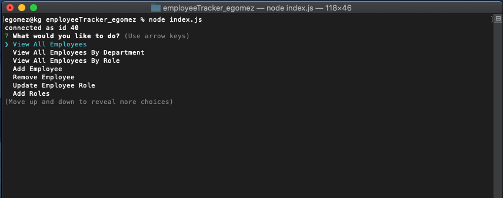
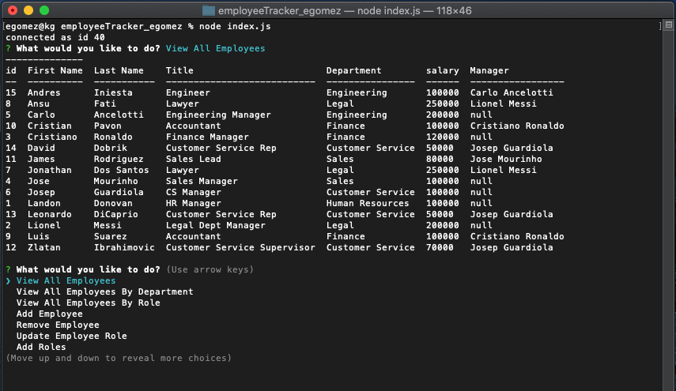

# employeeTracker_egomez

  

  ## Description

  A command-line application that allows you to add new department, add new roles, and add new employees to your database. You can also view your database tables and update the roles of employees if you have to.

  ## Table of Contents

  -[Installation](#installation)

  -[Usage](#Usage)

  -[License](#license)

  -[Contributing](#contributing)

  -[Tests](#tests)

  -[Questions](#questions)

  ## Installation

  npm i mysql npm i inquirer npm i console.table

  ## Usage

  Just be careful using repo.

  ## License

  This project is licensed under [MIT](https://opensource.org/licenses/MIT) license.

  ## Contributing

  Be careful and create your own branch.

  ## Tests

  tbd

  ## Questions

  If you have any questions about the repo, open an issue or contact me directly at egomezfax19@gmail.com. You can find more of my work at [www.github.com/egome019](https://github.com/egome019)
  
  ## Demonstration
  
  [Click here](https://drive.google.com/file/d/16NUdhM6Viv0FCOvHYyBYp2u0xBxQB7lx/view) to view a small recording of the application's functionality.
  
  

  
